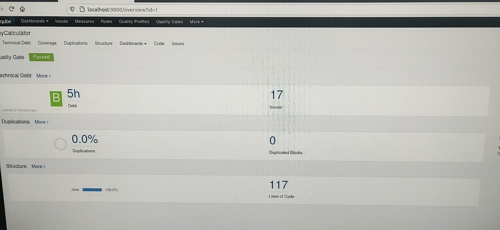

# Mid_Prectice
1. Java小程序Calculator实现的功能：

   - 当点击下方的运算符按钮时，第一排第二个按钮的文本变成相应符号。

   - 当点击“OK”按钮时，将算出表达式的结果并在第一排最后一个按钮显示。

     

2. 利用ANT通过HelloWorld的编译

3.  利用junit对HelloWorld.java进行测试：

4. 利用sonar对小程序进行分析：

